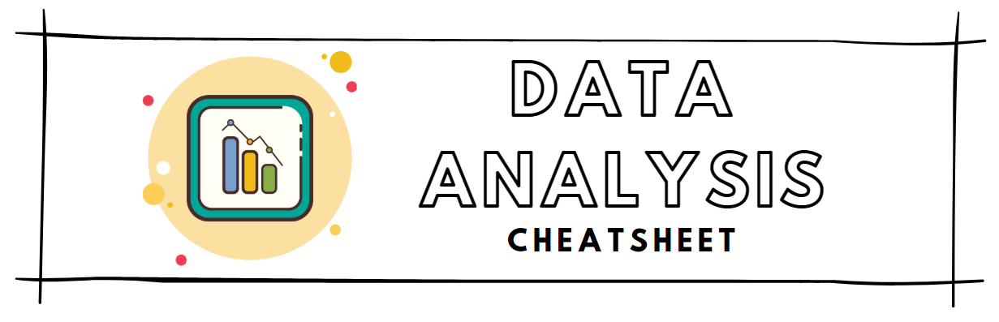

[Back to Cheatsheets](https://teanlouise.github.io/cheatsheets/)



# SOFTWARE
- [Matplotlib](https://teanlouise.github.io/matplotlib/)
- [Seaborn](https://teanlouise.github.io/seaborn/)
- [Numpy](https://teanlouise.github.io/numpy/)
- [Pandas](https://teanlouise.github.io/pandas/)


# Table of Contents
**[OVERVIEW](#OVERVIEW)**
- [Data Analysis Type](#Data-Analysis-Type)
- [Five Number Summary](#Five-Number-Summary)

**[CENTRAL TENDENCY](#CENTRAL-TENDENCY)**
- [Mean](#Mean)
- [Median](#Median)
- [Mode](#Mode)

**[VARIATION](#VARIATION)**
- [Variance](#Variance)
- [Standard Deviation](#Standard-Deviation)
- [Ranges](#Ranges)
- [Skewness](#Skewness)
- [Kurtosis](#Kurtosis)
- [Modality](#Modality)
- [Outliers](#Outliers)
- [Plots](#Plots)
    - [Histogram](#Histogram)
    - [Boxplot](#Boxplot)
    - [Violin](#Violin)

**[QUANTILES](#QUANTILES)**
- [Percentiles](#Percentiles)
- [Quartiles](#Quartiles)
- [Plots](#Plots)
    - [Q-Q](#Q-Q)
    - [Mean-Difference](#Mean-difference)

**[CURVE FITTING](#CURVE-FITTING)**
- [Straight Line](#Straight-line)
- [Least Squares](#Least-squares)
- [Residual Inspection](#Residual-Inspection)


# OVERVIEW

## Data Analysis Type

### UNIVARIATE DATA
- single variable
- measurement of single quantitative variable
- can be broken into categories
- can look at multivariate separately
- eg. temperature 

### BIVARIATE
- two variables, interested in their relationship
- might expect one to be response to other
- can be looked at individually using univariate scatterplots
- look at data by plotting 2D, starting point
- random scatter means there may not be a pattern
- eg. temperature and windspeed

### MULTIVARIATE
- more than twwo

## FIVE-NUMBER SUMMARY
- The minimum, first quartile, median, third quartile, and maximum of a dataset 
- This set of numbers is a great thing to compute when we get a new dataset.

# CENTRAL TENDENCY
- most common

## Mean
```
df.column_name.mean()

np.mean(dataset)

np.average(dataset)
```
- average
- interested in outliers
- average = total of values / number of values
- useful measurement to get the centre of a dataset

## Median
```
df.column_name.median()

np.median(dataset)
```
- midpoint when ordered
- not interested in outliers

- the middle value of a dataset that’s been ordered in terms of magnitude (from lowest to highest).
- the median value can provide an important comparison to the mean. Unlike a mean, the median is not affected by outliers.

## Mode
```
stats.mode(array_nums)
```
- most frequent occurring


# VARIATION
- spread of data

## Variance 
```
np.var(dataset)
```
- standard deviation **2
- numeric representation of the spread of the data 
- the difference between the data and the mean
- difference = X (single data point)− μ (mean)
- measured in units squared
- small number = data is close together, each data point will tend to be close to the mean, and the difference will be small. 
- large number = data spread out, the difference between every data point and the mean will be larger


## Standard Deviation
```
np.std(dataset)
```
- good when using mean
- tells us the spread of the data
- better to use than variance 
- computed by taking the square root of the variance
- By finding the number of standard deviations a data point is away from the mean, we can begin to investigate how unusual that datapoint truly is.
- The larger the standard deviation, the more spread out our data is from the center. 
- The smaller the standard deviation, the more the data is clustered around the mean.
- usually expect: 
    - around 68% of your data to fall within one standard deviation of the mean
    - 95% of your data to fall within two standard deviations of the mean
    - 99.7% of your data to fall within three standard deviations of the mean.
    - over three standard deviations away from the mean = incredibly unusual 

## Ranges

### Max, Min
```
df.column_name.min()
df.column_name.max()

np.amin(dataset)
np.amax(dataset)
```

### Interquartile Range
```
stats.iqr(dataset)
```
- inter-quartile (25-75%)
- good if using median
- q(0.75) - q(0.25) = spread in centre
- standard measure for comparing univariate 

## Skewness
- (mean-mode) / s
- left skew = -ve
- right skew = +ve
- symmetric = 0

- Skew = description of the data’s symmetry.

| Skew         | Peak    | Tails   | Median/Mode   | 
| -------------|:--------| --------|:--------------| 
| Symmetric    | one     | similar | similar       |
| Skew-right | left    | right   | median < mean |
| Skew-left  | right   | left    | median > mean |

## Kurtosis
- flat/sharp
- not used often

## Modality
- describes the number of peaks in a dataset. 
    - Unimodal:  one distinct peak, most common.
    - Bimodal: has two distinct peaks.
    - multimodal: more than two peaks
    - uniform distributions: no obvious clustering.

## Outliers
- Values that don’t fit within the majority of a dataset
- they can skew our data and lead to error in our analysis
- be useful in pointing out errors in our data collection.

- a data point that is far away from the rest of the dataset.
- do not have a formal definition
- easy to determine by looking at histogram
- often indicate an error in your data or an interesting insight.

## Plots

### HISTOGRAM
```
np.histogram(array_name, range= (min, max), bins = #)

plt.hist(dataset, range=(min, max), bins=#bins, edgecolor = 'black')
```
- standard first approach
- discrete values
- quick estimate of probability distribution of data
- show percentage of occurences vs. values
- good for small datasets
- image depends on bins

- reveal, through numbers, interpretable trends in your data
- summarize data that you can use to inform a decision or explain a distribution.
- The two key features of a histogram are bins and counts.
    - A bin is a sub-range of values that falls within the range of a dataset,  width of each bin is the distance between the minimum and maximum values of each bin, All bins in a histogram are always the same size
    - A count is the number of values that fall within a bin’s range.

#### Describe Histogram
1. Center (mean or median)
2. Range (max - min)
3. Shape (skewness)
4. Modality (peaks)
5. Outliers

### Boxplot 
- Also known as 'tukey boxplot' and 'whisker boxplot'
- show spread of data
- intuitive and consistent
- compact alternative to histogram
- compare multiple easier but less detail

### Violin Plot


# QUANTILES
```
np.quantile(dataset, [list of quantiles])
```
- some number where approximate fraction of data
    - f= 0.50   ~ 1/2 data <= q(0.50)     median
    - f = 0.25  ~ 1/4 data <- q(0.25)     lower quartile (25%)
    - f = 0.75  ~ 3/4 data <- q(0.75)     upper quartile (75%)
- falls on datapoint then no problem, but no set method to calculate them
- interpolation is most common
sort -> location fNth -> VfN+1 - VfN -> q(f)
f=0.5 -> fN=10 -> V11-V10 -> 69-68 -> q(0.5) = 68.5

| Quantiles           | Split    | Arg                                          |  
| --------------------|:--------:|:--------------------------------------------:|
| 2-quantile (median) | 2 groups | 0.5                                          | 
| quartiles           | 4 groups | [0,25, 0.5, 0.75]                            |
| quintiles           | 5 groups | [0.2, 0.4, 0.6, 0.8]                         | 
| deciles             | 10       | [0.1, 0.2, 0.3, 0.4, 0.5, 0.6, 0.7, 0.8, 0.9]| 
| percentiles         | 100      | [0.01, 0.02,....]                            | 

## Percentiles
```
np.percentile(patrons, 30)
```
- the Nth percentile is defined as the point N% of samples lie below it. 
- useful measurements because they can tell us where a particular value is situated within the greater dataset.

## Quartiles
```
np.quantile(dataset, Q#)
OR 
np.percentile(dataset, %#)
```
- split the data into fourths
- 0.5 = the second quartile (Q2), the median, 50th percentile, half below and half data above
- 0.25 = first quartile (Q1), 25th percentile
- 0.75 = third quartile (Q3), 75th percentile
- there is no universally agreed upon method of calculating quartiles
    1. Q1 and Q3 don't include Q2 
    - Q1 = take all of the data points smaller than Q2 and find the median
    - Q3 =  do the same process using the points that are larger than Q2.
    2. Q1 and Q3 include Q2 
    - include Q2 when calculating median from data points above and below for Q1 and Q3
- Even: One of the more common ways is to take the average of those two numbers.

## PLOTS

### Q-Q
- plot percentiles against percentile when 2 datasets have different number of points
- convert both to have 100 so can be plotted against
- if lie on line they they are the same

### Mean-difference
- subtract mean from values in Q-Q plot
- different way of displaying Q-Q plot
- plot y=1/2(A+B) against x = [B-A]


# CURVE FITTING

## Straight Line
- first bext step
- plot line of best fit, linear regression
- does line represent points? (Qualitative)
- find coeffecient of determination (R**2 - quantitative)
eg. 0.91 so this linear relationship explains 91% of the variation in y
- even if find linear correlation, doesnt tell us if meaningful relationship between data, look for more data to explain relationship
- correlation does not imply causation

### Correlation Coeffecient (R)
- tells relationship
- multiple R's to choose

### Coeffecient of Determination
- R**2 is always 0 or positive

### Pearsons
- standard to use for distributed data and linear relationships (dont do by hand)
- if positive then relationship is positive and positively correlated and both increase together
- negative means as one increases the other decreases
- 1 = largest (100%)
- 0 = no trend, scattered all over
- -1 = negative slope
- undefined = can calculate for perfect horizontal or vertical
- 0 = only means not linear correlation (may still be correlated)

### Spearmans
- not distributed/not linear data


## Least squares
- to fit curve software is looking how far above/below curve the points are, takes those distances and squares them and adds together to find the curve that gives the smallest value to that sum of squares
- reason why people like linear/polynomial fits as there are east/fast algorithms
- non-linear much hard with optimisation problems
- algorithms typically only care about vertical distance
- min sum square never usually write own optimisations
- sum of squares is sensitive to outliers
- ideas works for linear and polynomials

## Residual Inspection
- residuals are vertical distance between data and fitted line
- just plot residuals
- above line (bestfit) = positive
- below line == negative
- not useful for linear fits but non-linear makes easier to judge vertical difference
- subtract curve frim data - is there systematic deviation


