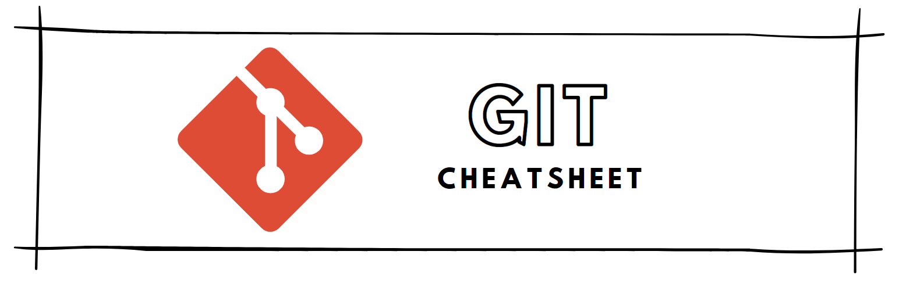

[Back to Cheatsheets](https://teanlouise.github.io/cheatsheets/)



# Table of Contents

**[BASIC GIT WORKFLOW](#BASIC-GIT-WORKFLOW)**
- [init](#init)
- [status](#status)
- [add](#add)
- [diff](#diff)
- [commit](#commit)
- [log](#log)

**[BACKTRACKING](#Backtracking)**
- [Head](#Head)
- [Checkout](#Checkout)
- [Add two files](#Add-two-files)
- [Reset](#Reset)

**[BRANCHING](#Branching)**
- [Check current](#Check-current)
- [Create](#Create)
- [Checkout](#Checkout)
- [Merge](#Merge)
- [Merge conflict](#Merge-conflict)
- [Delete](#Delete)

**[TEAMWORK](#Teamwork)**
- [Clone](#Clone)
- [List Remotes](#List-remotes)
- [Fetch](#Fetch)
- [Merge](#Merge)
- [Workflow](#Workflow)
- [Push](#Push)


# BASIC GIT WORKFLOW
1. Working directory: do all the work
2. Staging area: list all changes
3. Repository: where git stores the changes as versions

## init
```
git init
```
- initialise: start tracking, create repo

## status
```
git status
```
- check status of changes
- untracked (red): sees file but not started tracking changes)

## add
```
git add filename
```
- need to add to staging area to start tracking
- `git add .`: adds all files to staging area


## diff
```
git diff filename
```
- check difference between working directory and staging area


## commit
```
git commit -m "message"
```
- commit is last step, stores staging area inside repo
- `-m`: allows to add message (in quotation marks, present tense, 50chars or less)

## log
```
git log
```
- view earlier version of project, chronological
- 'q' key: to restore terminal

# BACKTRACKING
- Undo changes

## HEAD
```
git show HEAD
```
- HEAD: the commit you are currently on (most recent commit)

## Checkout
```
git checkout HEAD filename
OR
git checkout -- filename
```
- restore the file in your working directory to look exactly as it did when made last commit

## Add two files
```
git add filename1 filename2
```
- add more than one file to staging area

## Reset

### Single File
```
git reset HEAD filename
```
- unstage from staging area
- `M`: modification

### Different commit
```
git reset commit_SHA
```
- go back to previous commit, any commits after are erased, HEAD reassigned
- 'commit_SHA': first 7 characters of SHA of previous commit 


# BRANCHING
- create branches to experiment with versions of project

## Check current
```
git branch
```
- `*`: tells which branch on 

## Create
```
git branch branch_name
```
- name branch that describes its purpose
- no whitespaces in name

## Checkout
```
git checkout branch_name
```
- switch to this branch

## Merge
```
git merge branch_name`
```
- include all changes from branch to master
- `fast-forward`: contains most recent commit 
i.e. fast forwards master to be up to date with branch

## Merge Conflict
```
<<<<<< HEAD
master version of line
======
branch_name version of line
>>>>>> branch_name
```
- need to delete line dont want to keep that `add` and `commit`

## Delete
```
git branch -d branch_name
```
- end goal to to merge into master so once this is done purpose is served. 
- `-D`: if never merged into master


# TEAMWORK

## clone
```
git clone remote_location clone_name
```
- `remote_location`: is where to find remote eg. web address/filepath
- `clone_name`: name you give directory where git will clone repo, local copy

## list remotes
```
git remote -v
```
- git auto renames remote address to `origin`

## fetch
```
git fetch
```
- check if changes have been made to the remote and bring changes down to local
- doesn't merge changes, puts in remote branch

## merge
```
git merge origin/master
```
- fetched commits are on `origin/master`

## workflow
1. Fetch and merge changes from remote
2. Create branch to work on mew project feature
3. develop feature on branch and commit work
4. fetch and merge from remote again (in case new commits)
5. Push your branch up to the remote for review

## push
```
git push origin branch_name
```
- push you branch up to remote, `origin`