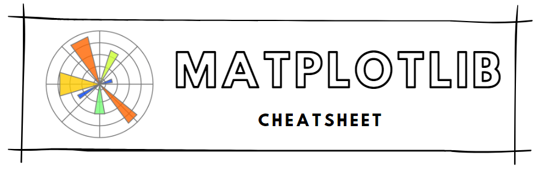

[Back to Cheatsheets](https://teanlouise.github.io/cheatsheets/)



# Table of Contents
**1. [ABOUT](#ABOUT)**
- [Import](#Import)
- [Show](#Show)
- [Close](#Close)

**2. [FORMATTING](#FORMATTING)**
- [Labels](#Labels)
- [Legend](#Legend)
- [Set Axis](#Set-axis)
- [Modify Ticks](#Modify-Ticks)
- [Subplot](#Subplot)
- [Figure](#Figure)
- [Seaborn Color](#Seaborn-Color)

**3. [LINE GRAPHS](#LINE-GRAPHS)**
- [Multiple](#Multiple) 
- [Line Format](#Line-format)
- [Shade Error](#Shade-eror)

**4. [BAR GRAPHS](#BAR-GRAPHS)**
- [Multiple](#Multiple)
- [Stacked](#Stacked)
- [Error Bars](#Error-bars)

**5. [PIE CHART](#PIE-CHART)**

**6. [HISTOGRAM](#HISTOGRAM)**
- [Multiple](#Multiple)

**7. [SCATTER](#SCATTER)**
- [3D](#3D)

**8. [BOXPLOT](#BOXPLOT)**


# ABOUT
- used to create graphs and charts
- if x_values are strings then x_values = range(len(string_list))

### Import
```
from matplotlib import pyplot as plt
```

### Show
- `plt.show()`

### Close
- `plt.close('all')`: closes all plots including those that may not have been displayed
- `plt.clf` : closes current figure


# FORMATTING

### Labels
```
plt.xlabel('x_name_string')
plt.ylabel('y_name_string'')
plt.title('title_string')
```


### Legend
- `plt.legend(['label1', 'label2'], loc=#)` : loc positions the legend (defult is best), if specify in .plot() dont need to include list of labels
    - 0 : best
    - 1 : upper right
    - 2 : upper left
    - 3 : lower left
    - 4 :lower right
    - 5 : right
    - 6 : center left
    - 7 : center right
    - 8 : lower center
    - 9 : upper center
    - 10 : center

### Set axis
```
plt.axis(arg)
```
- `plt.axis([min_x, max_x, min_y, max_y])` : zoom in on graph with specs
- `plt.axis('equal')` : shape a circle properly i.e. pie chart

### Modify ticks
```
ax = plt.subplot(args)
plt.plot(args)
ax.set_xticks([values_for_ticks])
ax.set_yticks([values_for_ticks], rotation=#)
```
- `ax` : an axes object, allows to modify axes in subplot
- `ax.set_xticklabels([label_names_for_ticks])`
- `ax.set_yticklabels([label_names_for_ticks])`

### Subplot
```
plt.subplot(#rows, #cols. index_plot_creating)
plt.plot()
```
- display two lines side-by-side in different axis, same figure
- any `plt.plot()` called after subplot will create line in that subplot
- `plt.subplots_adjust(op_args=value)` customise spacing between subplots
    - `left` : left-side margin (default of 0.125)
    - `right` : right-side margin (default of 0.9) 
    - `bottom` : bottom margin, with a default of 0.1
    - `top` : top margin, with a default of 0.9
    - `wspace` : the horizontal space between adjacent subplots, with a default of 0.2
    - `hspace` : the vertical space between adjacent subplots, with a default of 0.2

### Figure
- is the picture/object that contails all of the subplots
`plt.figure(figsize=(width, height))` : creates a new figure
`plt.savefig('name_of_graph.png')` : save as png, cbg, pdf


### Figures and Subplots
```
fig = plt.figure()
fig.add_subplot()
```
- add subplot to a figure

### Seaborn color
```
sns.set()
for col in 'xy':
  plt.hist(data[col], normed=True, alpha=0.5)
```


# LINE GRAPH
```
plt.plot(x_values, y_values, color='color_name', linestyle='style', marker='marker', label='for_legend', linewidth=#width)
```
- visualise how a variable changes over time
- `plt.plot(x_values, y_values)` : values1 vs. values2 = y_values vs. x_values

### Multiple
```
plt.plot(x1, y1)
plt.plot(x2, y2)
```
- call plot twice to have multiple line graphs on same axis

### Line Format
- color can be HTML color name or HEX name
- linestyle changes the line
    - `--` : dashed
    - `:` : dotted
    - ` ` : no line
- marker sets style for data points
    - `o` : circle
    - `s` : square
    - `*` : star

### Shade Error
```
y_lower = [i - error_value for i in y_values]
y_upper = [i + error_value for i in y_values]
plt.fill_between(x_values, y_lower, y_upper, aplha=transp_amount)
```
- create shaded error region, then plot line over it
- alpha transparency amount between 0 and 1


# BAR CHART
```
plt.bar(x_values, y_values)
```
- compare multiple categories of data
- the x-values — a list of x-positions for each bar
- the y-values — a list of heights for each bar

### Multiple
```
x_values1 = [t*element + w*n for element
             in range(d)]
```
- do this for both datasets (changing n for each)
    - n = # This is our first dataset (out of 2)
    - t = # Number of datasets
    - d = # Number of sets of bars
    - w = # Width of each bar (default is 0.8)

### Stacked
```
plt.bar(x1, y1)
plt.bar(x2, y2, bottom=y1)
```
- first set normal (will be bottom), second set with `bottom` set to first y (will be top)

### Error Bars
```
plt.bar(x_values, y_values, yerr=error_value, capsize=cap_width)
```
- caps: horizontal lines at top and bottom
- set error_value to be a list to have a different amount of error for each bar 

# PIE CHART
```
plt.pit(data_list, 
        labels=category_list, 
        autopct='format', 
        colors=list_colors
        shadow=True
        startangle=#
        pctdistance=#
        explode=explode)
```
- display elements as a proportions of a whole
- `plt.axis('equal')` : almost always need to use to reshape properly
- autopct : shows percentage on each slice with set format
    - '%0.2f' — 2 decimal places
    - '%0.2f%%' — 2 decimal places, but with a percent sign at the end
    - '%d%%' — rounded to the nearest int and with a percent sign at the end
- `explode = (0.1, 0, 0, 0, 0, 0, 0, 0, 0, 0, 0, 0)` : the offeset for each slice i.e. apply 0.1 offset to slice one so it is seperated from the rest of the chart

# HISTOGRAM
```
plt.hist(dataset, range=(min, max), bins=#bins, edgecolor = 'black')
```
- shows how many values in a dataset fall bbetween sets of numbers
- width of each bin is distance been min and max (same)
- height is the number of elements that fall in that bin
- default #bins = 10

### Multiple
```
plt.hist(a, range=(min, max), bins=#bins, alpha=#transp, normed=true)
plt.hist(b, range=(min, max), bins=#bins, alpha=#transp, normed=true)
```
- call plt.hist() twice before plt.show()
- `alpha=#transp` : 0 is entirely transparent, 1 is opaque
- `histtype='step` : just show outline instead of alpha
- `normed=True` : normalise histograms (good when different sample sizes)
- `linewidth=#width`

# SCATTER
```
plt.scatter(x_values, y_values)
```

### 3D
```
fig_3d = plt.figure()
fig_3d.add_subplot(1,1,1,projection='3d')
plt.scatter(x,y,z)
```

# BOXPLOTS
```
plt.boxplot(dataset)
or
plt.boxplot([dataset1, dataset2])
```
- one of the most common ways to visualize a dataset
- give you a sense of the central tendency and spread of the data.

- line in the center of the box = median (may not be exactly in middle of box)
- edges of the box = first and third quartiles. 
- box length = interquartile range (the middle 50% of data)
- whiskers = spread of dataset. There are many different ways to calculate the length of the whiskers.
    - closest point that is 1.5 * IQR from Q1 and Q3 (eg. Q1 - (1.5*IQR))
    - min and max
    - one standard deviation from mean
- dots beyond whiskers = outliers 


